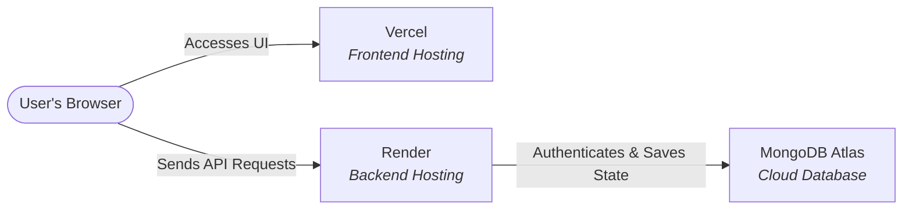

# Sunshine's Todo — Deployment Guide

To share **Sunshine's Todo** with anyone so they can access it on their browser anytime and have their data stored securely, you need to deploy the frontend (client) and backend (server) to the cloud and connect them to a cloud database.

By using your own custom authentication backed by MongoDB, we have completely decoupled the application from Firebase. This makes deployment much simpler and faster.

Here is the complete roadmap and step-by-step instructions to achieve this using free-tier services.

---

## Architecture Overview



1. **Frontend (Vite + React)**: Hosted on **Vercel** (fast, global CDN, auto-deploys from GitHub, free).
2. **Backend (Node.js + Express)**: Hosted on **Render** (free tier web services, runs your node server).
3. **Database (MongoDB)**: Hosted on **MongoDB Atlas** (free 5GB cloud database cluster, persists data 24/7).

---

## Step 1: Set Up MongoDB Atlas (Cloud Database)

Since hosting platforms like Render have ephemeral filesystems (meaning any files saved locally, like `db.json`, are deleted whenever the server restarts or goes to sleep), you **must** use a cloud database to store user data permanently.

1. Go to [MongoDB Atlas](https://www.mongodb.com/cloud/atlas) and sign up for a free account.
2. Click **Create a Database** and select the **M0 Free Tier** (5GB storage, which is more than enough for thousands of tasks and journal entries).
3. Choose a provider (e.g., AWS) and region close to you (e.g., `us-east-1` or `ap-south-1`).
4. **Security Quickstart**:
   - **Username & Password**: Create a database user (e.g., username `sunshine_user` and a strong password). **Save these credentials!**
   - **IP Access List**: To allow your Render server to connect from anywhere, add `0.0.0.0/0` (Allow access from anywhere) to the IP access list.
5. Once the cluster is created, click **Connect** -> **Drivers** (Node.js).
6. Copy the connection string. It will look like this:
   ```
   mongodb+srv://sunshine_user:<password>@cluster0.xxxx.mongodb.net/?retryWrites=true&w=majority&appName=Cluster0
   ```
7. Replace `<password>` with the password you created for the database user. This is your `MONGODB_URI`.

---

## Step 2: Deploy the Backend Server to Render

1. Push your project repository to **GitHub**. Make sure your `.env` files are in your `.gitignore` so your keys and database URIs are never exposed publicly.
2. Sign up or log in to [Render](https://render.com/).
3. Click **New +** and select **Web Service**.
4. Connect your GitHub repository.
5. Configure the Web Service settings:
   - **Name**: `sunshine-todo-backend`
   - **Region**: Choose a region close to your database.
   - **Branch**: `main` (or your active branch)
   - **Root Directory**: `server` (Important! This tells Render to run commands inside the server folder)
   - **Runtime**: `Node`
   - **Build Command**: `npm install && npm run build`
   - **Start Command**: `npm start`
   - **Instance Type**: `Free`
6. Scroll down and click **Advanced** to add **Environment Variables**:

| Key | Value | Description |
|---|---|---|
| `PORT` | `10000` | The port Render will expose |
| `NODE_ENV` | `production` | Enables production optimizations and combined logging |
| `MONGODB_URI` | *Your MongoDB Atlas connection string* | Links your server to the cloud database |
| `JWT_SECRET` | *A random long string (e.g., `sunshine_prod_secret_key_2026`)* | Used to sign your custom JWT auth tokens |
| `CLIENT_ORIGIN` | *Leave blank for now (update later with Vercel URL)* | Restricts CORS requests to your frontend |

7. Click **Create Web Service**. Render will build and deploy your backend. Once it's live, copy the service URL (e.g., `https://sunshine-todo-backend.onrender.com`).

---

## Step 3: Deploy the Frontend Client to Vercel

1. Sign up or log in to [Vercel](https://vercel.com/).
2. Click **Add New** -> **Project**.
3. Import your GitHub repository.
4. Configure the Project settings:
   - **Project Name**: `sunshine-todo`
   - **Framework Preset**: `Vite` (Vercel will auto-detect this)
   - **Root Directory**: `client` (Important! This tells Vercel to build the frontend app)
5. Expand the **Environment Variables** section and add the following variable:

| Key | Value |
|---|---|
| `VITE_API_URL` | `https://sunshine-todo-backend.onrender.com/api` *(Your deployed Render URL + /api)* |

6. Click **Deploy**. Vercel will build the React app and give you a public URL (e.g., `https://sunshine-todo.vercel.app`).

---

## Step 4: Link and Secure the Apps

To make sure CORS is secure:
1. Go back to your backend service on **Render**, navigate to **Environment**, and update the environment variable:
   - `CLIENT_ORIGIN` = `https://sunshine-todo.vercel.app` (Your Vercel frontend URL)
2. Render will automatically redeploy the backend with this setting, ensuring that only your official website can communicate with your database API.

---

## How It Works in Production 🎉

Once deployed:
1. When your friend opens `https://sunshine-todo.vercel.app`, they see your login screen.
2. They click "Sign Up" and enter their details. 
3. The frontend makes a registration API request to your Render backend, which hashes their password and saves them in the `users` list inside MongoDB.
4. The server returns a secure JWT token. The frontend stores this token in `localStorage` and attaches it as a `Bearer` token to all future requests.
5. When they create tasks, add events, or write journal entries, the backend scopes those records to their unique `uid` in the database cache.
6. The backend saves the updated database state securely in your **MongoDB Atlas** cloud database.
7. Even if your Render server restarts or goes to sleep, **no data is ever lost** because it is reloaded from MongoDB Atlas the moment the server wakes up!
