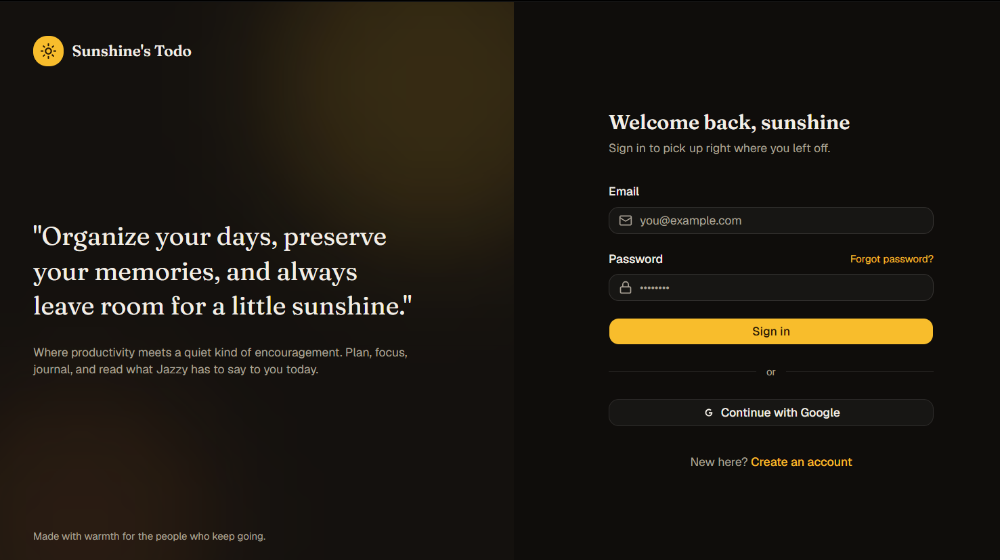
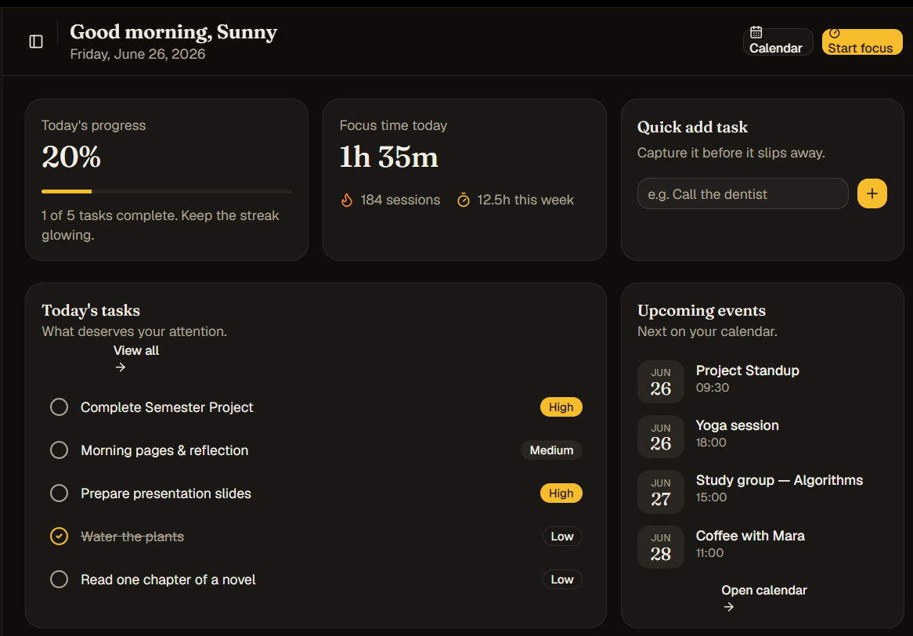
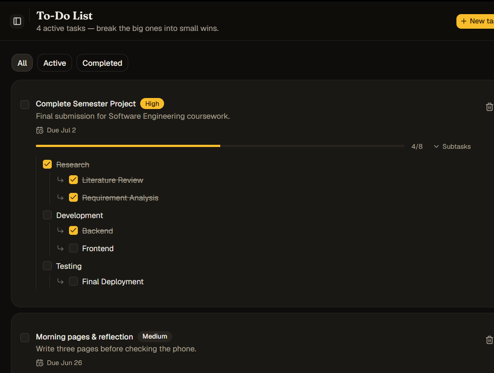
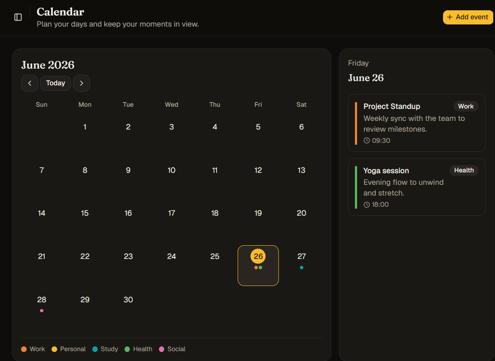
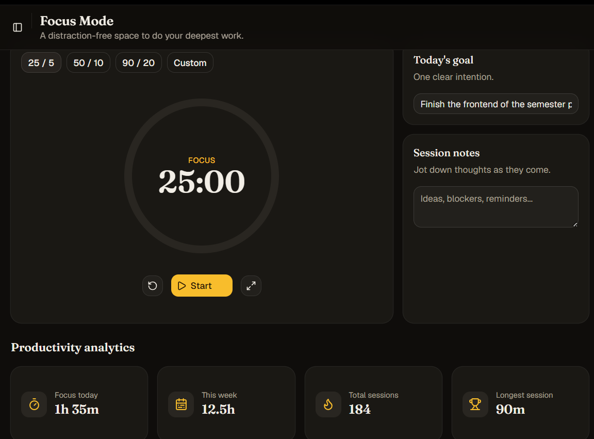
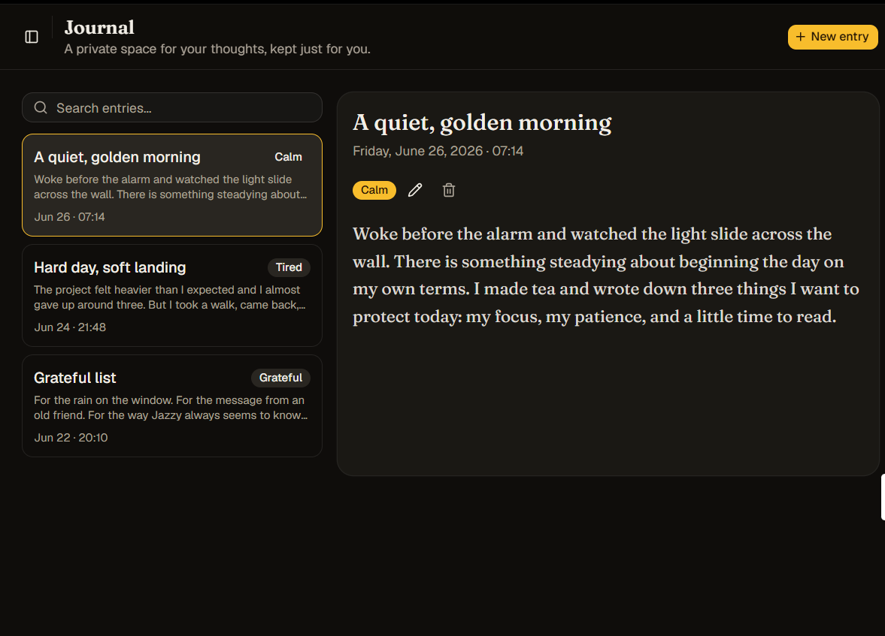

# Sunshine''s Todo — Implementation Plan

> **Version:** 1.0
> **Date:** June 2026
> **Tagline:** *"Organize your days, preserve your memories, and always leave room for a little sunshine."*

---

## Table of Contents

1. [Project Overview](#1-project-overview)
2. [Tech Stack](#2-tech-stack)
3. [Project Structure](#3-project-structure)
4. [UI Design Reference](#4-ui-design-reference)
5. [Phase 1 — Frontend](#5-phase-1--frontend)
6. [Phase 2 — Backend](#6-phase-2--backend)
7. [Firestore Database Schema](#7-firestore-database-schema)
8. [Estimated Timeline](#8-estimated-timeline)

---

## 1. Project Overview

**Sunshine''s Todo** is a personalized productivity and journaling web application. It blends task management, calendar scheduling, structured focus sessions, private journaling, and a heartfelt daily inspiration feature into a single elegant platform.

### Core Modules

| Module | Description |
|---|---|
| Authentication | Secure login, registration, password reset, email verification |
| Dashboard | Personalized overview of daily progress, tasks, events, and focus time |
| To-Do Management | Full CRUD tasks with subtask nesting and priority management |
| Calendar & Events | Monthly/weekly calendar with color-coded events and reminders |
| Event Timeline | Chronological auto-generated history of all calendar events |
| Focus Mode | Distraction-free fullscreen workspace with session timer |
| Pomodoro System | Structured work sessions (25/5, 50/10, 90/20, Custom) with analytics |
| Journal | Private journaling with rich text, mood tracking, and search |
| Jazzy''s Page | Daily heartfelt messages, poems, and personal notes from Jazzy |
| Admin Dashboard | Admin panel for managing daily content, notes, poems, and quotes |
| Profile & Settings | Avatar, display name, password, and notification preferences |

---

## 2. Tech Stack

### Frontend

| Technology | Purpose |
|---|---|
| React 18 | UI library |
| Vite | Build tool & dev server |
| TypeScript | Type safety |
| Tailwind CSS v3 | Utility-first styling |
| ShadCN UI | Accessible component primitives |
| Framer Motion | Animations & page transitions |
| React Router DOM v6 | Client-side routing |
| React Hook Form | Form management & validation |
| Zod | Schema validation |
| Recharts | Productivity analytics charts |
| Tiptap | Rich text editor (Journal) |
| Lucide React | Icon library |
| React Query (TanStack) | Server state management (Phase 2) |

### Backend

| Technology | Purpose |
|---|---|
| Node.js | Runtime |
| Express.js | REST API framework |
| TypeScript | Type safety |
| Firebase Admin SDK | Server-side Firebase access |
| Zod | Request body validation |
| Helmet | Security headers |
| Morgan | HTTP request logging |
| express-rate-limit | Rate limiting |
| CORS | Cross-origin configuration |

### Infrastructure

| Service | Provider |
|---|---|
| Authentication | Firebase Authentication |
| Database | Firebase Firestore |
| File Storage | Firebase Storage |
| Frontend Hosting | Vercel |
| Backend Hosting | Render |

### Design System

| Token | Value |
|---|---|
| Primary Background | `#0D0D0D` — Deep Charcoal Black |
| Card Background | `#1A1A1A` — Soft Dark Gray |
| Accent | `#F5C518` — Golden Yellow |
| Secondary Accent | `#FF8C42` — Warm Orange |
| Text Primary | `#F0F0F0` — Near White |
| Text Muted | `#6B6B6B` — Dim Gray |
| Font | Inter / Geist (Google Fonts) |

---

## 3. Project Structure

```
sunshine-todo/
├── client/                          ← Frontend (React + Vite)
│   ├── public/
│   ├── src/
│   │   ├── assets/
│   │   ├── components/
│   │   │   ├── ui/                  ← ShadCN base components
│   │   │   ├── layout/              ← Sidebar, Topbar, AppLayout
│   │   │   └── shared/              ← Cards, Modals, Badges, Charts
│   │   ├── pages/
│   │   │   ├── auth/
│   │   │   ├── admin/
│   │   │   ├── DashboardPage.tsx
│   │   │   ├── TodoPage.tsx
│   │   │   ├── CalendarPage.tsx
│   │   │   ├── EventTimelinePage.tsx
│   │   │   ├── FocusModePage.tsx
│   │   │   ├── PomodoroPage.tsx
│   │   │   ├── JournalPage.tsx
│   │   │   ├── JazzyPage.tsx
│   │   │   └── ProfilePage.tsx
│   │   ├── hooks/
│   │   ├── context/
│   │   ├── routes/
│   │   ├── lib/
│   │   ├── types/
│   │   └── main.tsx
│   ├── tailwind.config.ts
│   └── vite.config.ts
│
├── server/                          ← Backend (Node.js + Express)
│   ├── src/
│   │   ├── config/
│   │   ├── routes/
│   │   ├── controllers/
│   │   ├── middleware/
│   │   ├── services/
│   │   └── types/
│   └── package.json
│
└── documentation/
    ├── Sunshine.docx
    ├── IMPLEMENTATION_PLAN.md
    └── ui-designs/
        ├── login.png
        ├── dashboard.png
        ├── todo.png
        ├── calendar.png
        ├── focus-pomodoro.png
        └── journal.png
```

---

## 4. UI Design Reference

These are the UI mockups provided in the original specification document. All pages must be built to faithfully match these designs in terms of layout, color palette, typography, and overall feel.

---

### Login Page

Two-column layout: decorative brand panel (left) + sign-in form (right). Golden "Sign in" CTA button. Google sign-in option.



---

### Dashboard

Grid layout with Today''s Progress, Focus Time, Quick Add Task, Today''s Tasks list, and Upcoming Events. Clean card-based layout with golden accents.



---

### To-Do List

Task list with priority badges (High/Medium/Low), due dates, expandable subtask tree with progress bar, and filter tabs (All / Active / Completed).



---

### Calendar

Full monthly calendar grid with color-coded event category dots. Selected day shows event detail panel on the right. Category legend at the bottom.



---

### Focus Mode & Pomodoro

Circular timer display with mode tabs (25/5, 50/10, 90/20, Custom). Today''s Goal input and Session Notes on the right. Productivity analytics stat cards below.



---

### Journal

Split layout: entry list (left) with mood tags and timestamps, full entry reader/editor (right) with mood badge and edit/delete actions.



---

## 5. Phase 1 — Frontend

> **Goal:** Build the complete UI with all pages, animations, and interactions using mock/static data. No real API calls. Every screen must visually match the UI designs above.

---

### 1.1 Project Scaffolding & Design System

- Initialize Vite project with `--template react-ts`
- Install and configure Tailwind CSS v3
- Initialize ShadCN UI with `npx shadcn-ui@latest init`
- Install: Framer Motion, React Router DOM v6, React Hook Form, Zod, Recharts, Tiptap, Lucide React
- Define Tailwind theme tokens matching the design system
- Import Inter font from Google Fonts in `index.css`
- Configure path alias `@/` in `vite.config.ts` and `tsconfig.json`

**Files:**
- `client/vite.config.ts`
- `client/tailwind.config.ts`
- `client/src/index.css` — Global styles, CSS variables, font imports

---

### 1.2 Global Layout & Navigation

#### `src/components/layout/Sidebar.tsx`
- Collapsible sidebar (icon-only ↔ icon + label)
- Nav items: Dashboard, To-Do, Calendar, Timeline, Focus, Pomodoro, Journal, Jazzy''s Page
- Active route highlighted with golden accent left border
- Smooth collapse/expand with Framer Motion `AnimatePresence`
- Bottom: user avatar + name + Settings link

#### `src/components/layout/Topbar.tsx`
- Page title (changes per route)
- Global search bar
- Notification bell + user avatar dropdown (Profile / Logout)
- Time-aware greeting: *Good morning / Good afternoon / Good evening, [Name]*

#### `src/components/layout/AppLayout.tsx`
- Wraps all authenticated pages with Sidebar + Topbar + main content
- Page transitions via Framer Motion `<AnimatePresence>`

---

### 1.3 Authentication Pages

> Reference: [Login Page Design](#login-page)

All auth pages: two-column layout — brand left panel + form right panel.

#### `src/pages/auth/LoginPage.tsx`
- Email + Password fields (toggle visibility icon)
- "Remember me" checkbox, "Forgot password?" link → `/forgot-password`
- Golden "Sign in" button with loading spinner state
- "Continue with Google" button (UI only in Phase 1)
- Link to Sign Up
- Framer Motion card fade-up on mount

#### `src/pages/auth/SignUpPage.tsx`
- Full Name, Email, Password, Confirm Password
- Real-time password strength indicator bar
- Zod + React Hook Form validation
- Link to Login

#### `src/pages/auth/ForgotPasswordPage.tsx`
- Email input form
- Success state: checkmark animation + "Check your inbox" message

#### `src/pages/auth/EmailVerificationPage.tsx`
- Static success screen with animated envelope icon
- "Resend email" button (mock)

---

### 1.4 Dashboard

> Reference: [Dashboard Design](#dashboard)

#### `src/pages/DashboardPage.tsx`

| Widget | Description |
|---|---|
| WelcomeBanner | "Good morning, [Name]" + today''s date |
| TodayProgressCard | Progress % + progress bar + "X of Y tasks complete" |
| FocusTimeSummaryCard | Focus time today, total sessions, this week''s hours |
| QuickAddTask | Inline text input + "+" button |
| TodayTasksList | Task rows with priority badges, completion circles, "View all" link |
| UpcomingEventsWidget | Date block + event name + time for next 4 events |

- Staggered entrance animation (80ms delay between cards)
- Top-right quick action buttons: Calendar shortcut, Start Focus shortcut

---

### 1.5 To-Do Management

> Reference: [To-Do List Design](#to-do-list)

#### `src/pages/TodoPage.tsx`

**Filter Tabs:** All / Active / Completed  
**"+ New task"** button (golden, top right)

**Task Cards:**
- Checkbox (completion toggles strikethrough animation)
- Title (bold), description (muted)
- Priority badge: High (golden) / Medium (muted)
- Due date chip
- Delete 🗑️ button
- Expand → inline subtask tree with progress bar (e.g. 4/8)

**Subtask Tree:**
- Nested groups (e.g. Research → Literature Review, Requirement Analysis)
- Each subtask has its own checkbox + strikethrough on completion
- Parent group shows its own completion checkbox

**Add / Edit Task Modal:**
- React Hook Form + Zod: Title, Description, Due Date, Priority
- Dynamic subtask rows (add/remove)
- Framer Motion scale-in animation

---

### 1.6 Calendar & Event Management

> Reference: [Calendar Design](#calendar)

#### `src/pages/CalendarPage.tsx`

- Monthly calendar grid (7 columns × 6 rows)
- Navigation: `<` Today `>` buttons + current month/year
- Each day cell: date number + colored event dots (by category)
- "Today" cell: golden background ring
- Click a day → right panel slides in showing:
  - Day title (e.g. "Friday, June 26")
  - Event cards with: color bar, title, category badge, time
- Category legend bar at bottom: Work / Personal / Study / Health / Social
- "**+ Add event**" button (golden, top right)

**Add / Edit Event Modal:**
- Fields: Title, Description, Date, Start Time, End Time, Category, Color, Reminder toggle

---

### 1.7 Event Timeline

#### `src/pages/EventTimelinePage.tsx`

- Vertical timeline (newest at top) with golden left connector line
- Each card: color dot, event title, description, scheduled date, created at, last updated badge
- Staggered Framer Motion card entrance animations
- Search bar + date range filter (from / to date pickers)
- Empty state illustration

---

### 1.8 Focus Mode & Pomodoro

> Reference: [Focus Mode & Pomodoro Design](#focus-mode--pomodoro)

#### `src/pages/FocusModePage.tsx` + `src/pages/PomodoroPage.tsx`

**Timer Section (left):**
- Mode tabs: `25 / 5` | `50 / 10` | `90 / 20` | `Custom`
- Large circular ring timer showing `MM:SS` in bold serif font
- Phase label: "FOCUS" in golden caps above the time
- Controls: Reset 🔄 | **▶ Start** (golden CTA) | Fullscreen ⤢

**Side Panel (right):**
- "Today''s goal" card — editable text input ("One clear intention.")
- "Session notes" card — textarea for thoughts during session

**Productivity Analytics (below):**

| Stat Card | Value shown |
|---|---|
| Focus today | 1h 35m |
| This week | 12.5h |
| Total sessions | 184 |
| Longest session | 90m |

Charts: bar chart (weekly hours), area chart (monthly), line chart (30-day trend)

---

### 1.9 Journal

> Reference: [Journal Design](#journal)

#### `src/pages/JournalPage.tsx`

**Left Panel — Entry List:**
- Search bar: "Search entries..."
- Entry cards: Title, mood tag badge, excerpt (2 lines), date + time
- Selected entry highlighted with golden border
- "**+ New entry**" button (golden, top right)

**Right Panel — Entry Detail:**
- Title (large serif font)
- Date + time (muted, e.g. "Friday, June 26, 2026 · 07:14")
- Mood badge (colored, e.g. "Calm")
- Edit ✏️ and Delete 🗑️ icon buttons
- Full entry text (rich, serif body text)

**Edit Mode:**
- Tiptap rich text editor (Bold, Italic, Bullets, Headings, Blockquote)
- Mood selector grid (Calm, Tired, Grateful, etc.)
- Auto-timestamp on save

---

### 1.10 What Jazzy Has to Say

#### `src/pages/JazzyPage.tsx`

- Soft animated background: floating particles or aurora gradient
- Warmer color palette (amber, rose tones contrast from the rest of the app)

| Section | Description |
|---|---|
| Daily Message | Large card with a rotating mock heartfelt message. Gentle pulse animation. |
| A Note from Jazzy ❤️ | Styled as a slightly-tilted handwritten note card with paper texture. |
| Today''s Poem | Glassmorphism card with italic centered poem text + author credit. |

---

### 1.11 Profile & Settings

#### `src/pages/ProfilePage.tsx`

| Section | Content |
|---|---|
| Avatar | Image + upload overlay button (no real upload in Phase 1) |
| Personal Info | Display name (editable), Email (read-only) |
| Security | Change password form (current / new / confirm) |
| Notifications | Toggle switches: daily reminders, event alerts, focus end alerts |
| Appearance | Dark mode toggle (default: on) |

---

### 1.12 Admin Dashboard

#### `src/pages/admin/AdminDashboardPage.tsx`

Only accessible with `isAdmin: true` flag (mock in Phase 1).

| Tab | Functionality |
|---|---|
| Daily Notes | Table of Jazzy notes — Add / Edit / Delete / Schedule for specific date |
| Content Library | Poems, literature, quotes — Add / Edit / Delete |
| Archive | All past published content |

---

### 1.13 Routing & Guards

#### `src/routes/AppRoutes.tsx`

```
Public:
  /login              → LoginPage
  /signup             → SignUpPage
  /forgot-password    → ForgotPasswordPage
  /verify-email       → EmailVerificationPage

Protected (require auth):
  /                   → DashboardPage
  /todo               → TodoPage
  /calendar           → CalendarPage
  /timeline           → EventTimelinePage
  /focus              → FocusModePage
  /pomodoro           → PomodoroPage
  /journal            → JournalPage
  /jazzy              → JazzyPage
  /profile            → ProfilePage

Admin-only:
  /admin              → AdminDashboardPage
```

- `ProtectedRoute` → redirects to `/login` if not authenticated
- `AdminRoute` → extends ProtectedRoute; redirects to `/` if not admin

---

### 1.14 Global State & Types

#### `src/context/AuthContext.tsx`
- Provides: `user`, `isAuthenticated`, `isAdmin`, `login()`, `logout()`, `register()`
- Phase 1: mock implementation (no real network calls)

#### `src/types/index.ts`

```typescript
interface User {
  uid: string;
  displayName: string;
  email: string;
  photoURL?: string;
  isAdmin: boolean;
}

interface Task {
  id: string;
  uid: string;
  title: string;
  description?: string;
  priority: 'high' | 'medium' | 'low';
  status: 'active' | 'completed';
  dueDate?: string;
  createdAt: string;
  updatedAt: string;
}

interface Subtask {
  id: string;
  parentTaskId: string;
  title: string;
  status: 'active' | 'completed';
  createdAt: string;
}

interface CalendarEvent {
  id: string;
  uid: string;
  title: string;
  description?: string;
  date: string;
  startTime: string;
  endTime?: string;
  category: string;
  color: string;
  reminder: boolean;
}

interface JournalEntry {
  id: string;
  uid: string;
  title: string;
  content: string;
  mood: string;
  createdAt: string;
  updatedAt: string;
}

interface FocusSession {
  id: string;
  uid: string;
  mode: '25/5' | '50/10' | '90/20' | 'custom';
  durationMinutes: number;
  startedAt: string;
  completedAt: string;
  notes?: string;
}

interface JazzyNote {
  id: string;
  content: string;
  scheduledDate: string;
  isPublished: boolean;
  createdAt: string;
}
```

---

### Phase 1 Completion Checklist

- [ ] All pages render without errors
- [ ] All forms validate and show error messages
- [ ] Navigation works across all routes from sidebar
- [ ] ProtectedRoute redirects unauthenticated users to /login
- [ ] AdminRoute blocks non-admin users
- [ ] Page transition animations play correctly
- [ ] Sidebar collapse/expand works
- [ ] Pomodoro timer counts down and switches Work/Break phases
- [ ] Journal rich text editor is functional
- [ ] All charts render with mock data
- [ ] Responsive layout holds at ≥ 1024px
- [ ] All pages match the UI design mockups

---

---

## 6. Phase 2 — Backend

> **Goal:** Replace all mock data with real Firebase Auth, a Node.js + Express.js REST API, and Firestore persistence. Wire every page to live data end-to-end.

---

### 2.1 Backend Scaffolding

#### `server/` setup

- Initialize Node.js + TypeScript project
- Install: express, firebase-admin, zod, helmet, morgan, cors, express-rate-limit, dotenv
- Configure Firebase Admin SDK in `server/src/config/firebase.ts`
- Express app in `server/src/app.ts`

**Environment variables (`server/.env`):**
```
PORT=5000
FIREBASE_PROJECT_ID=
FIREBASE_CLIENT_EMAIL=
FIREBASE_PRIVATE_KEY=
CLIENT_ORIGIN=https://sunshine-todo.vercel.app
```

---

### 2.2 Firebase Setup

1. Create Firebase project `sunshine-todo`
2. Enable Authentication: Email/Password + Google Sign-In
3. Enable Firestore (region: `asia-south1`, production mode)
4. Enable Firebase Storage
5. Download service account JSON → populate `.env`
6. Deploy Firestore security rules (user-scoped reads/writes, admin-only content collections)

---

### 2.3 Authentication (Real)

#### Update `client/src/context/AuthContext.tsx`

| Function | Firebase Call |
|---|---|
| `register()` | `createUserWithEmailAndPassword` + `sendEmailVerification` |
| `login()` | `signInWithEmailAndPassword` |
| `loginWithGoogle()` | `signInWithPopup(googleProvider)` |
| `logout()` | `signOut()` |
| `forgotPassword()` | `sendPasswordResetEmail()` |

- Extract Firebase ID token → attach as `Authorization: Bearer <token>` via Axios interceptor

#### New `server/src/middleware/authMiddleware.ts`
- Verify Firebase ID token using Admin SDK
- Attach decoded `uid` to `req.user`
- Return 401 if token is missing or invalid

---

### 2.4 Task & Subtask APIs

#### `server/src/routes/tasks.ts`

```
GET    /api/tasks                              Get all tasks for user
POST   /api/tasks                              Create task
PUT    /api/tasks/:taskId                      Update task
DELETE /api/tasks/:taskId                      Delete task + all subtasks (batch)
PATCH  /api/tasks/:taskId/status               Toggle complete/incomplete

GET    /api/tasks/:taskId/subtasks             Get subtasks
POST   /api/tasks/:taskId/subtasks             Create subtask
PUT    /api/tasks/:taskId/subtasks/:sid        Update subtask
DELETE /api/tasks/:taskId/subtasks/:sid        Delete subtask
PATCH  /api/tasks/:taskId/subtasks/:sid/status Toggle subtask status
```

- All tasks scoped to authenticated `uid`
- On task delete: batch delete all child subtasks

---

### 2.5 Calendar & Timeline APIs

#### `server/src/routes/calendar.ts`

```
GET    /api/events                Get all events (optional ?month=&year=)
POST   /api/events                Create event → auto-create timeline entry (batch)
PUT    /api/events/:eventId       Update event → update timeline entry
DELETE /api/events/:eventId       Delete event → delete timeline entry

GET    /api/timeline              Full chronological timeline for user
GET    /api/timeline/:noteId      Single timeline entry
```

**Key:** Creating/editing/deleting an event always keeps the Event Timeline in sync via Firestore batch writes.

---

### 2.6 Journal APIs

#### `server/src/routes/journal.ts`

```
GET    /api/journal               All entries for user (sorted by createdAt desc)
GET    /api/journal/:entryId      Single entry
POST   /api/journal               Create entry
PUT    /api/journal/:entryId      Update entry
DELETE /api/journal/:entryId      Delete entry
```

---

### 2.7 Focus & Pomodoro APIs

#### `server/src/routes/focus.ts`

```
POST   /api/focus/session         Record completed session
GET    /api/focus/stats           Today / weekly / monthly stats
GET    /api/focus/history         All sessions (paginated)
GET    /api/focus/streak          Current daily streak
```

**Stats response:**
```json
{
  "todayMinutes": 95,
  "weekMinutes": 320,
  "monthMinutes": 1240,
  "totalSessions": 184,
  "longestSession": 90,
  "dailyBreakdown": [{ "date": "2026-06-20", "minutes": 50 }]
}
```

---

### 2.8 Jazzy Content APIs

#### `server/src/routes/jazzy.ts`

```
GET    /api/jazzy/daily           Today''s note (admin note or fallback)
GET    /api/jazzy/poem            Today''s poem (rotates from Firestore pool)
GET    /api/jazzy/quote           Today''s quote
```

**Daily Message Logic:**
1. Query `jazzyNotes` where `scheduledDate == today` AND `isPublished == true`
2. If found → return that note
3. If not found → select from poem/quote pool (`dayOfYear % pool.length`)
4. Cache result in-memory per day (resets at midnight)

---

### 2.9 Admin APIs

#### `server/src/routes/admin.ts`

All routes protected by `adminMiddleware` (checks `isAdmin: true` in Firestore).

```
GET/POST/PUT/DELETE  /api/admin/notes          Jazzy daily notes CRUD
PATCH                /api/admin/notes/:id/schedule   Set scheduled date
PATCH                /api/admin/notes/:id/publish    Publish / unpublish

GET/POST/PUT/DELETE  /api/admin/poems          Poems CRUD
GET/POST/DELETE      /api/admin/quotes         Quotes CRUD
GET                  /api/admin/archive        All past published content
```

---

### 2.10 Profile & Storage

#### `server/src/routes/profile.ts`

```
GET    /api/profile                Get user profile from Firestore
PUT    /api/profile                Update display name
POST   /api/profile/photo          Upload avatar → Firebase Storage → return URL
PUT    /api/profile/notifications  Update notification preferences
```

**Avatar upload flow:**
1. Client sends `multipart/form-data` with image
2. Server uploads to `avatars/{uid}/avatar.jpg` in Firebase Storage
3. Returns public download URL
4. Updates `users/{uid}.photoURL` in Firestore

---

### 2.11 Security Middleware

| Middleware | Purpose |
|---|---|
| `authMiddleware.ts` | Verify Firebase ID token on every protected route |
| `adminMiddleware.ts` | Check `isAdmin` in Firestore users collection |
| `rateLimitMiddleware.ts` | 100 req/15min global; 10 req/min on auth routes |
| `errorMiddleware.ts` | Global error handler → consistent JSON error format |
| `validationMiddleware.ts` | Zod schema validators for all request bodies |

**Standard error format:**
```json
{
  "error": "Validation failed",
  "details": [{ "field": "title", "message": "Title is required" }],
  "status": 400
}
```

---

### 2.12 Deployment

| Service | Platform | Details |
|---|---|---|
| Frontend | Vercel | Auto-deploy from `main` branch |
| Backend | Render | Node.js web service |
| Database | Firebase Firestore | `asia-south1` region |
| Storage | Firebase Storage | Profile photos |
| Auth | Firebase Authentication | Email/Password + Google |

**Vercel env vars:** `VITE_API_BASE_URL`, `VITE_FIREBASE_*` keys  
**Render env vars:** all `server/.env` values

---

### Phase 2 Completion Checklist

- [ ] Firebase Auth: register, login, Google Sign-In, forgot password, email verify all work
- [ ] Tasks CRUD fully persists in Firestore
- [ ] Subtask progress bar reflects real data
- [ ] Creating a calendar event auto-creates a timeline entry
- [ ] Editing a calendar event updates its timeline entry
- [ ] Deleting a calendar event removes its timeline entry
- [ ] Pomodoro sessions persist; analytics show real numbers
- [ ] Journal entries save rich text content correctly
- [ ] Jazzy page shows admin''s scheduled note when published
- [ ] Jazzy page falls back to poem/quote when no note is scheduled
- [ ] Admin routes return 403 for non-admin users
- [ ] Profile avatar uploads to Firebase Storage and persists
- [ ] Rate limiting active on auth routes
- [ ] CORS blocks requests from unknown origins
- [ ] Frontend live on Vercel, backend live on Render

---

## 7. Firestore Database Schema

```
firestore/
│
├── users/{uid}
│   ├── displayName: string
│   ├── email: string
│   ├── photoURL: string
│   ├── isAdmin: boolean
│   └── createdAt: timestamp
│
├── tasks/{taskId}
│   ├── uid, title, description
│   ├── priority: "high" | "medium" | "low"
│   ├── status: "active" | "completed"
│   ├── dueDate, createdAt, updatedAt: timestamp
│
├── subtasks/{subtaskId}
│   ├── parentTaskId, uid, title
│   ├── status: "active" | "completed"
│   └── createdAt: timestamp
│
├── calendarEvents/{eventId}
│   ├── uid, title, description
│   ├── date (YYYY-MM-DD), startTime, endTime (HH:MM)
│   ├── category, color (hex), reminder: boolean
│   └── createdAt: timestamp
│
├── eventTimeline/{noteId}
│   ├── uid, eventId, eventTitle, eventDescription
│   ├── scheduledDate, createdAt, updatedAt: timestamp
│
├── journalEntries/{entryId}
│   ├── uid, title, content (Tiptap HTML)
│   ├── mood (emoji key)
│   └── createdAt, updatedAt: timestamp
│
├── focusSessions/{sessionId}
│   ├── uid, mode, durationMinutes
│   ├── startedAt, completedAt: timestamp
│   └── notes: string
│
├── jazzyNotes/{noteId}        ← Admin-managed
│   ├── content, scheduledDate (YYYY-MM-DD)
│   ├── isPublished: boolean
│   └── createdAt: timestamp
│
├── poems/{poemId}             ← Admin-managed
│   ├── title, content, author
│   └── createdAt: timestamp
│
├── quotes/{quoteId}           ← Admin-managed
│   ├── text, author, category
│
└── literature/{litId}         ← Admin-managed
    ├── title, content, source
    └── createdAt: timestamp
```

---

## 8. Estimated Timeline

| Phase | Task | Duration |
|---|---|---|
| **Phase 1** | Project scaffolding + design system | 2 days |
| **Phase 1** | Global layout (Sidebar, Topbar, AppLayout) | 1 day |
| **Phase 1** | Auth pages (Login, Sign Up, Forgot, Verify) | 1–2 days |
| **Phase 1** | Dashboard page + all widgets | 2 days |
| **Phase 1** | To-Do page + subtasks | 2 days |
| **Phase 1** | Calendar + Event Timeline | 2–3 days |
| **Phase 1** | Focus Mode + Pomodoro + charts | 2 days |
| **Phase 1** | Journal + rich text editor | 1–2 days |
| **Phase 1** | Jazzy''s Page + Profile + Admin UI | 2 days |
| **Phase 1** | Routing, guards, polish, animations | 1–2 days |
| | **Phase 1 Total** | **~16–20 days** |
| | | |
| **Phase 2** | Backend scaffolding + Firebase setup | 2 days |
| **Phase 2** | Real Firebase Auth integration | 1 day |
| **Phase 2** | Task & Subtask APIs + frontend wiring | 2 days |
| **Phase 2** | Calendar, Timeline, Journal APIs | 2 days |
| **Phase 2** | Focus, Pomodoro APIs + stats | 1–2 days |
| **Phase 2** | Jazzy content APIs + fallback logic | 1 day |
| **Phase 2** | Admin APIs + middleware | 1–2 days |
| **Phase 2** | Profile, Storage, Security hardening | 1 day |
| **Phase 2** | Deployment (Vercel + Render) + QA | 2 days |
| | **Phase 2 Total** | **~13–16 days** |
| | | |
| | **Grand Total** | **~4–6 weeks** |

---

*End of Implementation Plan — Sunshine''s Todo v1.0*
